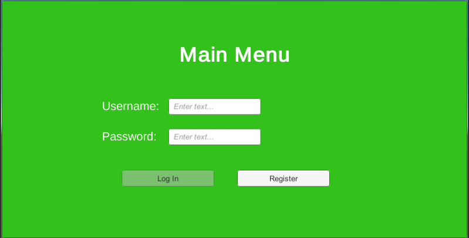

# Product-Database

## Description
This is a product database supporting products logistics within the international business. The current model is still in alpha phase and needs more development, but it works pretty well currently. It can add, search and view products which meets the initial requirements.

## Development
This database is built using two different environment. First, the interface and the menu is built within Unity, using C# and several user interface effects. Secondly, the back-end database is developed using php language to query SQL commands and get data from MAMMP database. There are two different databases: the first database stores user login, in which the password is carefully hash to prevent personal information leak and the second databse store different product information. Especially, in order to store image in the databse, I have researched and found a way to convert images into Int64String on C# and put into the MAMMP database as a blob variable.

## Future innovation
This database management will be developed later in the year. Some bugs related to changing and saving information will be fixed shortly within the next few weeks.Potential development features would be efficient search (without the need for exact name, maybe using ID like in the store instead?) and transaction data will be stored into a text file so that it can printed out by the end of the week or month, just like in the bank system. The database is still on local mode, which means I can only access the database on my computer. However, there is still a way to host execution by following the instruction below.

## Programming Language
C#

## Major components
* Unity
* MAMMP SQL Database

## Database Set up Instruction
1/ Download MAMP database
2/ Open MAMP and wait until Apache Server and MySQL server are on, then open WebStart page
3/ Create 2 databases:
 a/ userdatabase
   - Create a table called users with these columns: id (int(10)), username(varchar(16)), hash(varchar(100)), salt(varchar(50))
   - The id column with the extra section be set to Auto-Increment.
 b/ productinfodatabase
   - Create a table called products with these columns: id (int(10)), name(varchar(100)), price(varchar(100)), description(longtext), product_user(longtext), image(longtext)
   - The id column with the extra section be set to Auto-Increment.
 
4/ Add the sqlconnect folder into htdocs folder inside the C:/MAMP folder
5/ Run the executable file inside the Built Apps folder
